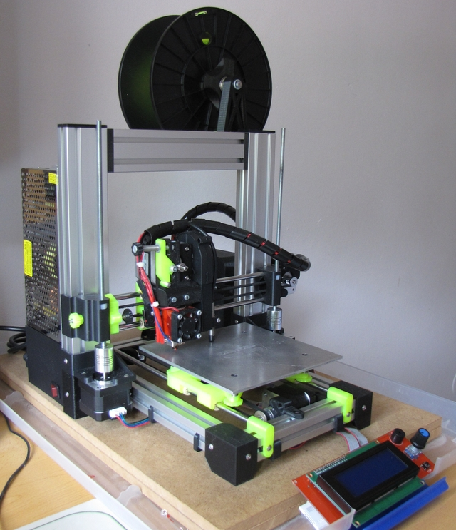

# What's that?

**Huxley reloaded** is a remastered version of ReprapPRO Huxley 3D printer assembled with aluminium slots.

Openscad files are supplied in order to make your own custom adjustements.

Thankx to...

  * [rowokii](https://www.thingiverse.com/thing:767317), parametric universal spool holder.
  * [Francisco Malpartida](https://github.com/fmalpartida), mini heatbed's board author. 

...for their respective works.

**Latest version is 3.1.**

Documentation will be uploaded at the wiki asap!.

Details and more info on [wiki](https://github.com/isidorogv/Huxley-reloaded/wiki) page.

enjoy!!