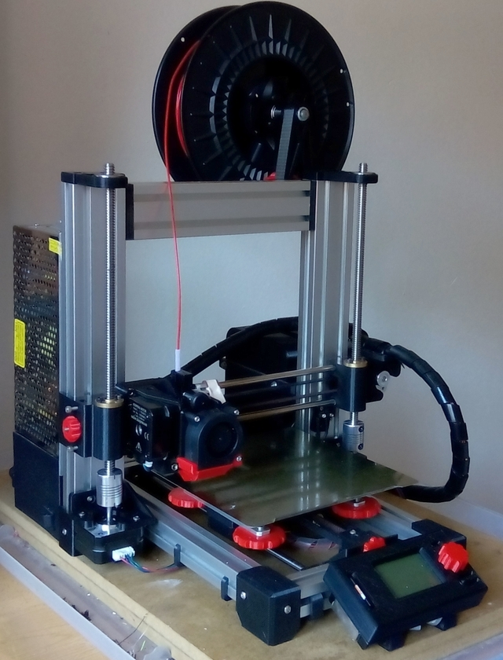

# What's that?

**Huxley reloaded** is a remastered version of ReprapPRO Huxley 3D printer assembled with aluminium slots.

Since version 3.0, migration from openscad to freecad have been started. STL and STEP files are supplied in order to allow you to make your own adjustements.

Thankx to...

  * [rowokii](https://www.thingiverse.com/thing:767317), parametric universal spool holder.
  * [Francisco Malpartida](https://github.com/fmalpartida), mini heatbed's board author. 
* [Campy3D](https://www.thingiverse.com/thing:2915718), LCD MKS Mini 12864 Mount Enclosure Box.
...for their respective works.

Wiki page will not be available anymore but assembly instructions will be supplied as PDF guide.

**Latest version is 3.1.**

Version 3.2 is comming!!

enjoy!!