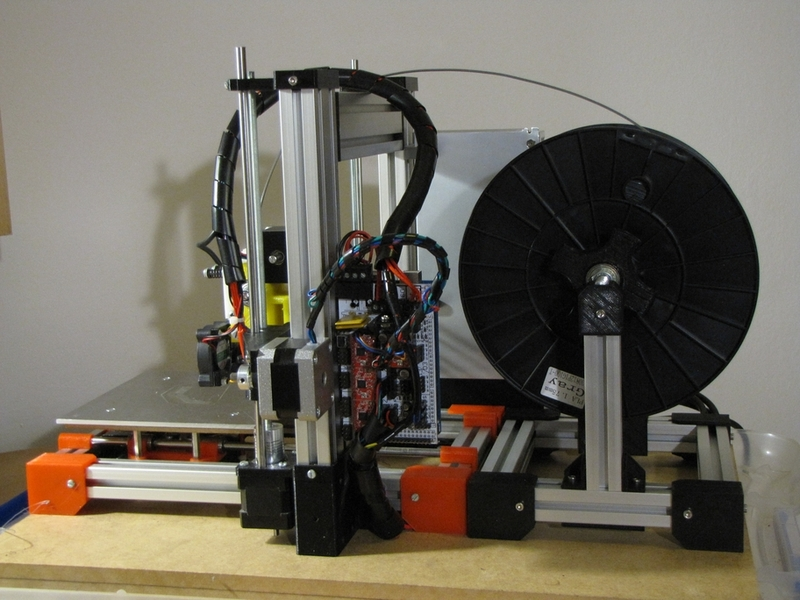

# Huxley reloaded

Huxley reloaded is a remastered version of ReprapPRO Huxley 3D printer assembled with aluminum slots.

Openscad files are supplied in order to make your own custom adjustements.

Thankx to:

  * ReprapPRO (large and small gears, x-carriage-1off.stl)
  * ePoxi https://www.thingiverse.com/thing:279973
  * jmgiacalone (M6-Block.stl)
  * rowokii https://www.thingiverse.com/thing:767317

for their respective works.

Latest version is 2.2, but this work is still in progress...

Details and more info on wiki page.

enjoy!!