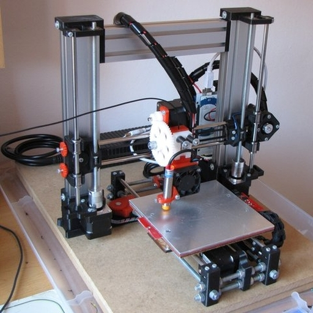
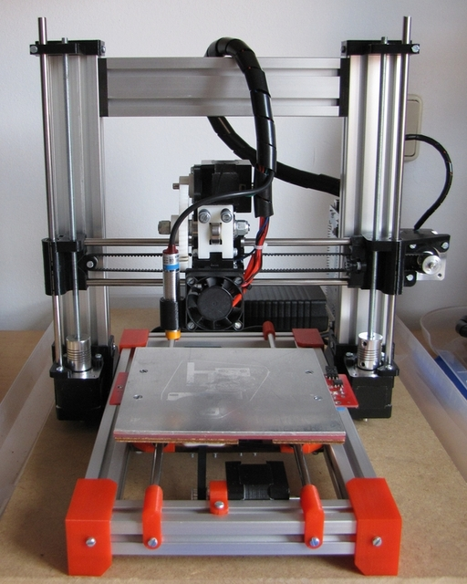
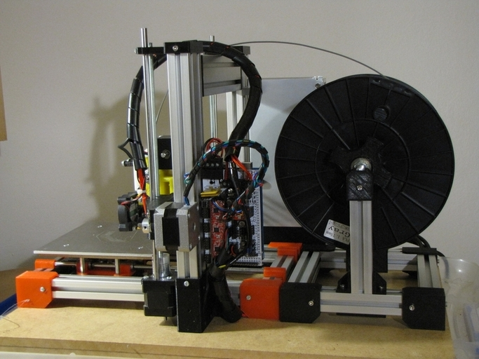
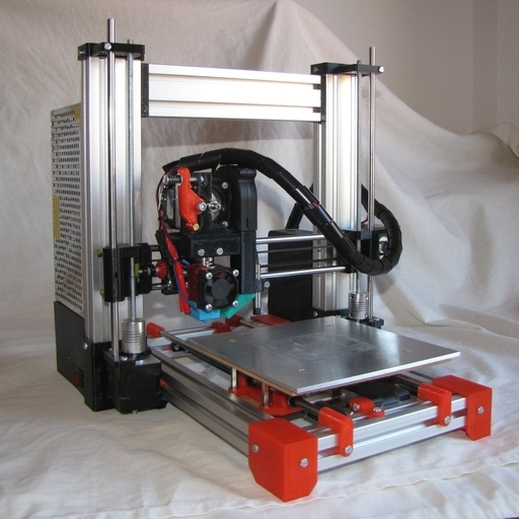
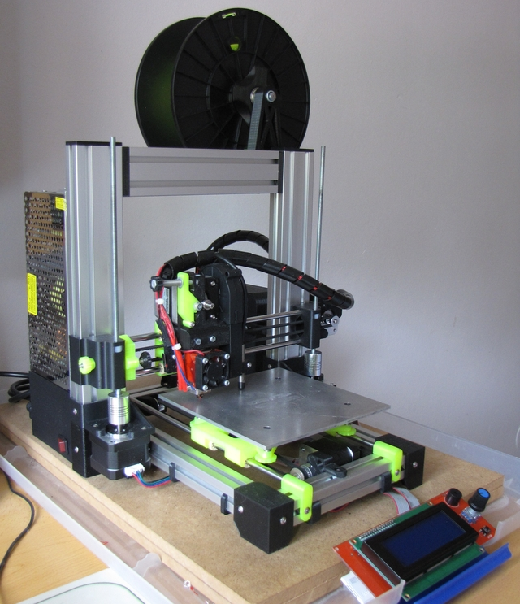

## v.1.0 
-------

**Changes:**
* _Prusai3-like_ frame.
* Aluminum slots on Z axis.
* Autolevel inductive sensor included.
* Threaded rods for Y axis.

## v.2.0
-------

**Changes:**
* Installed a _prusai3-like_ extruder instead the OVA (Original Version Adquired) one (bowden). 
* Ramps v1.4 replaces Melzi v.1.2 board.
* J-head hotend replaces de OVA hotend.
* Cooling hotend fan.

## v.2.1
-------

**Changes:**
* Aluminum Y axis frame instead threaded rods.
* _Prusai3-like_ X axis pieces replaces the OVA ones.
* Adjustable end stops on both Y and X axis.

## v.2.2
-------

**Changes:**
* PSU changed from original 19v to 12v.
* OVA 19v. Heatbed exchanged with [Heatbed mini](https://github.com/fmalpartida/heatbed-mini), by Francisco Malpartida
* X axis NEMA17 replaces original NEMA14.
* Merlin hotend replaces J-Head.
* Aluminum spool holder.
* Minor changes on wire arrangement.

## v.3.0
-------

**Changes:**
* SAV MkI Rev. D electronics replaces Ramps v1.4.
* E3Dlite V6 hotend instead Merlin hotend.
* Mk8 direct extruder.
* Axial layer fan.
* Printed box for electronics housing.

## v.3.1
-------

**Changes:**
* GT2560 electronics replaces broken SAV MKI Rev. D.
* TMC2208 instead DRV drivers (so silent!).
* NEMA17 in all axis for better torque.
* X axis motor holder and idler modified to eliminate wobbling.
* Upper bearing holder in Z axis removed to allow axis move freely (that eliminates a lot of noise).
* Now printing Volume has been increased in 23% (15x15x15cm instead 14x14x14cm).
* 2004 LCD controller included!
* Intedrated spool holder.
